## Transferring objects from Blender to Unreal (by Ivan)

First challenge was transferring the lego F1 car made out of geometry lego nodes to Unreal Engine since geometry nodes are not directly supported.

The solution I found was to convert the geometry nodes setup to a complete mesh, meaning my F1 car is made out of approximetely 11,000 inidividual lego pieces. 

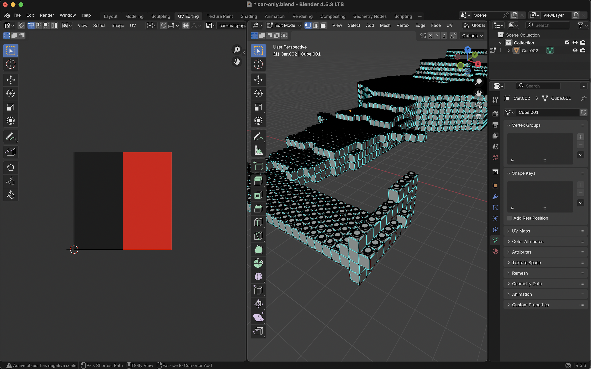

Next challenging task was to paint all 11,000 lego pieces in the same livery like in the render file. I ended up creating multiple UV maps from different sides to transfer the livery. 

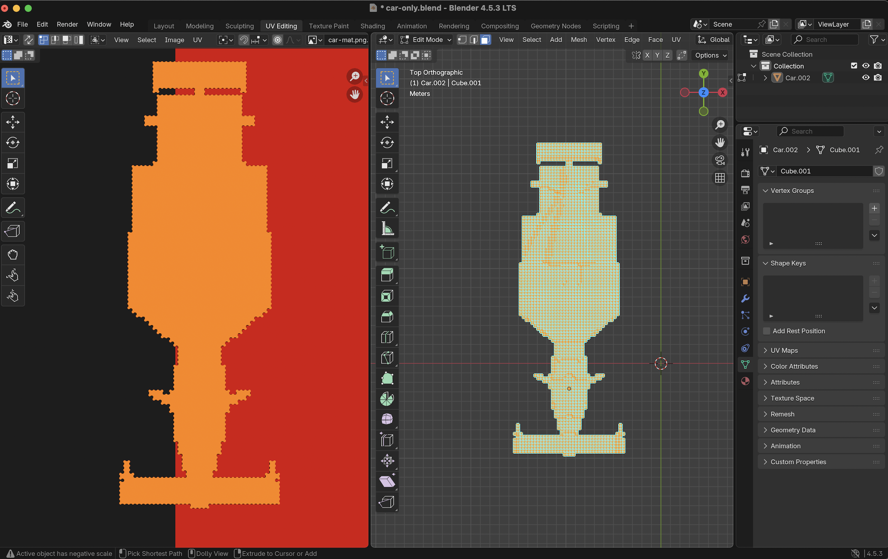

But even after I was able to get a complete mesh of my car, trasnferring to unreal wasn't a straitforward process due to the complexity of the structure.

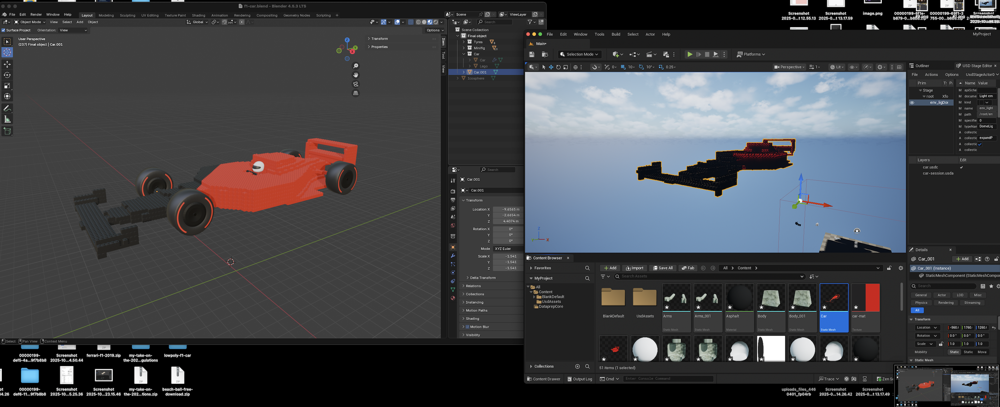

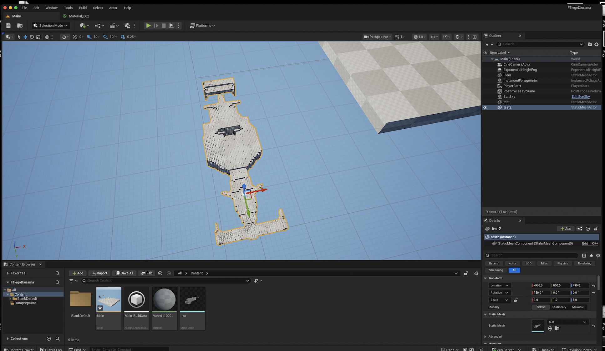

After a couple of tries using many conversion methods I was able to get my car successfully ported using the USD file type. 

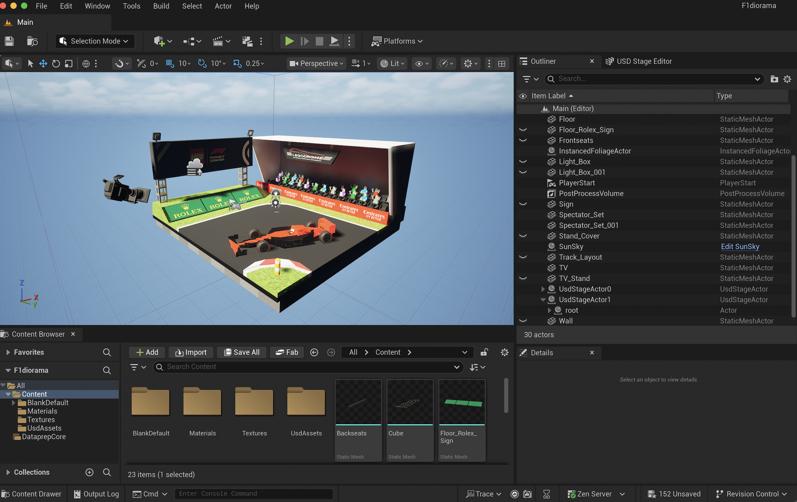

The environment was an easier task since it would've been static, so I was able to use the same USD format and port the environment directly by applying materials previously created in Blender.

For the TV I used the fbx file format because I would later animate the TV turning on in the demo.

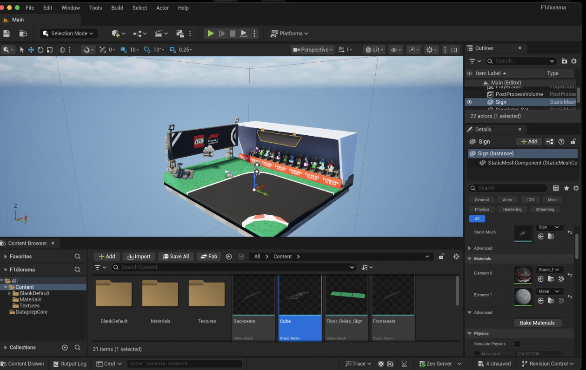

## Animation and Camera work in Unreal (by Ivan)

I first created basic Blueprints to see how movement and animation of the levels works in Blender

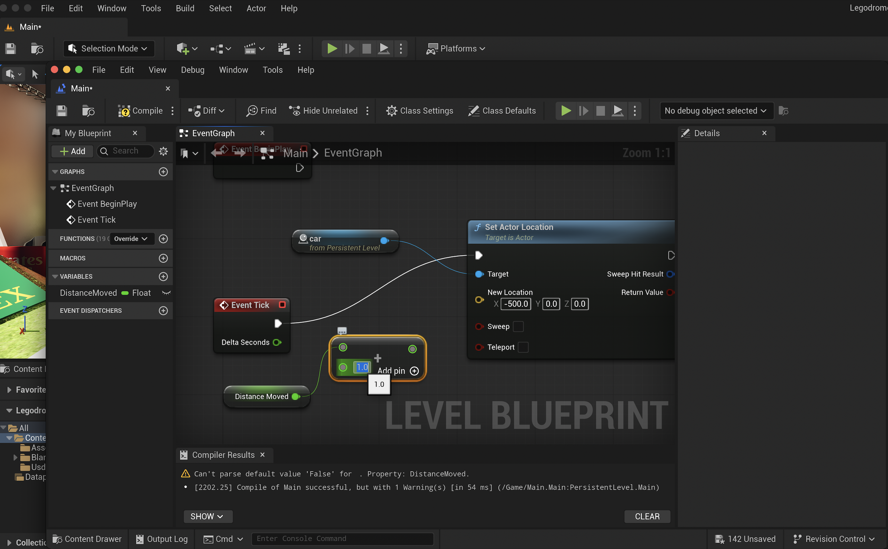

I then started working on sequence and figuring out the movement of the car on the track. 

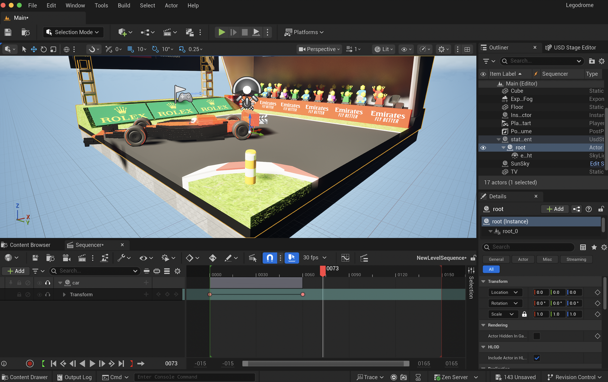

After figuring out how to spin the car in the middle around it's own wheel base, I started animating rotation of each wheel giving it the spinning animation. 

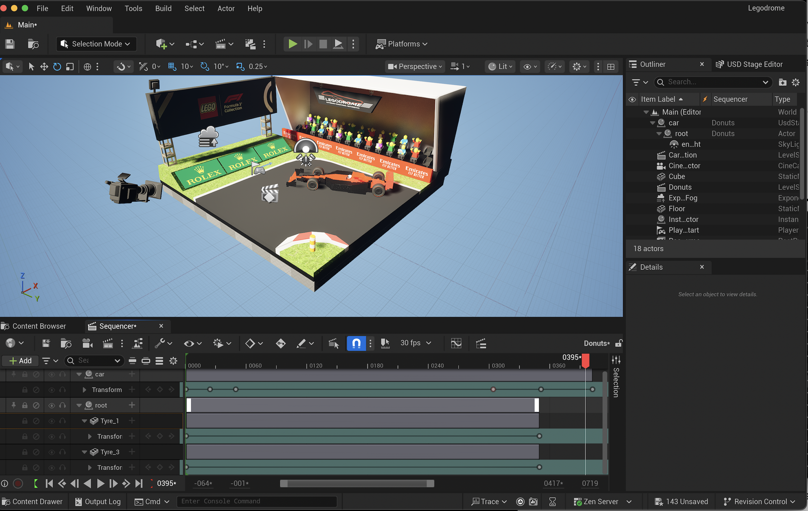

To get the smoke effect from drifting I used Niagara Smoke effect with my custom settings. Later one I ended up abandoning using smoke because it wouldn't show up in the render and after extensive research I found out that it's a common issue and no fix is known yet. 

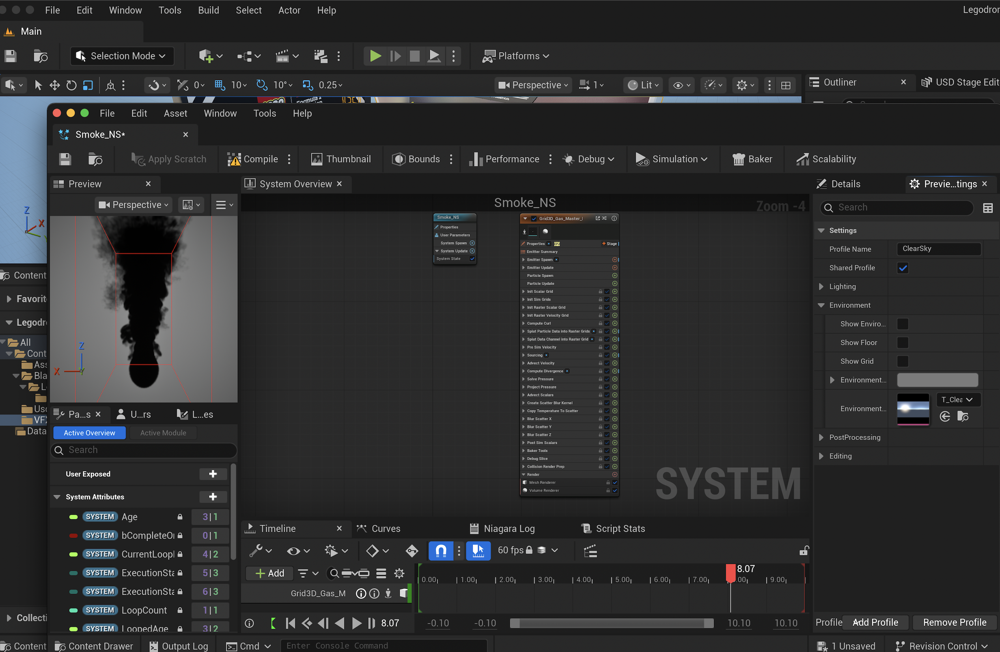

Putting everything together in a sequence and figuring out the right speed and positioning for donuts. 

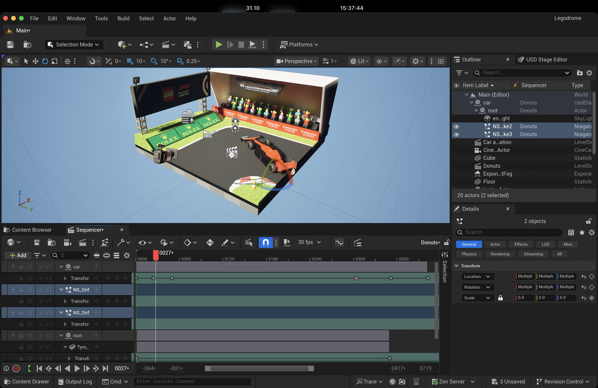

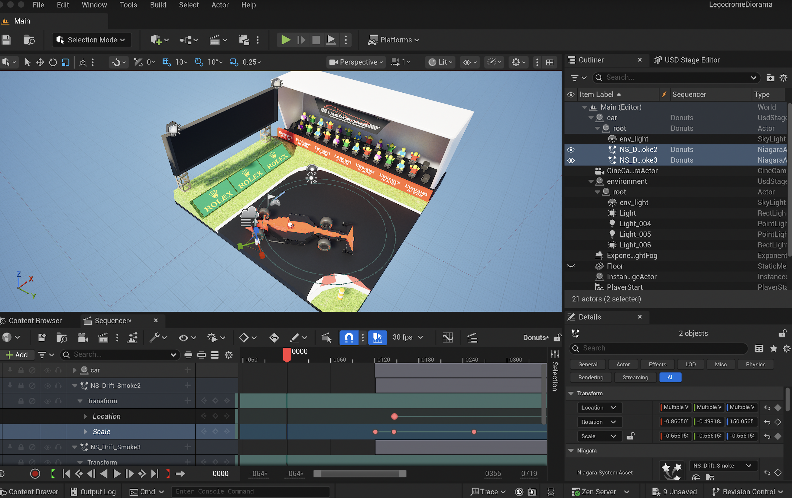

Then I moved onto to camera rigging to simulate the feeling of zooming in onto the diorama. 

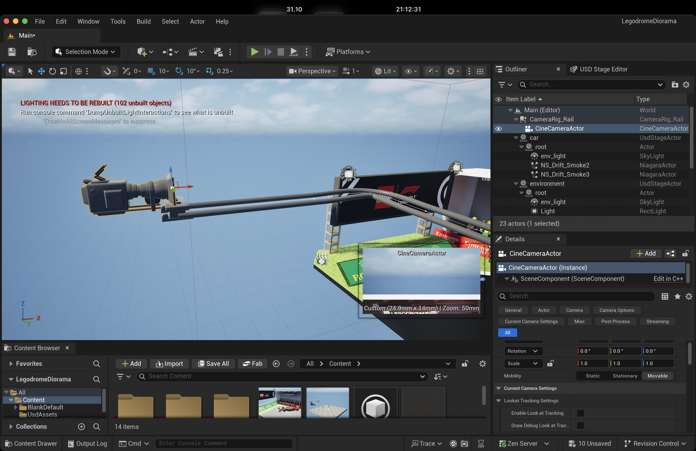

Putting the camera rig and keying it onto the main sequence.

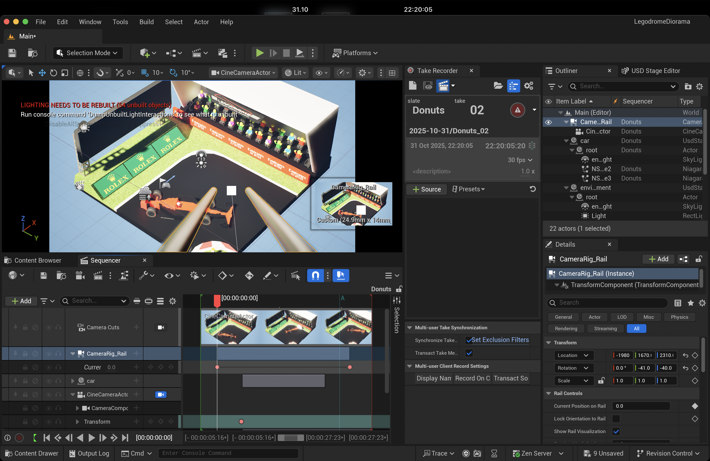

Rendering and converting each individual frame into a video using ffmpeg

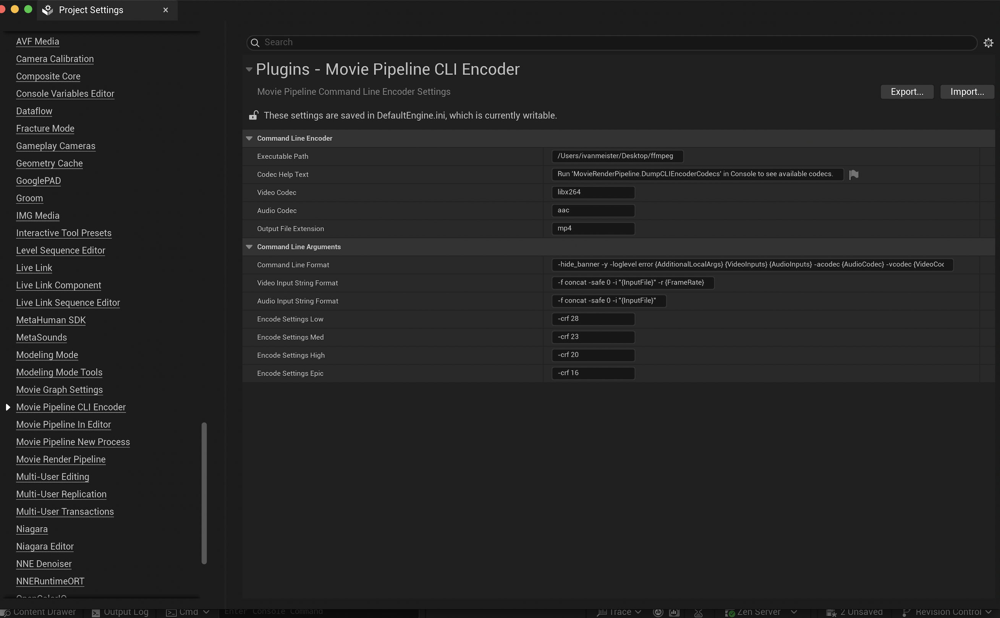

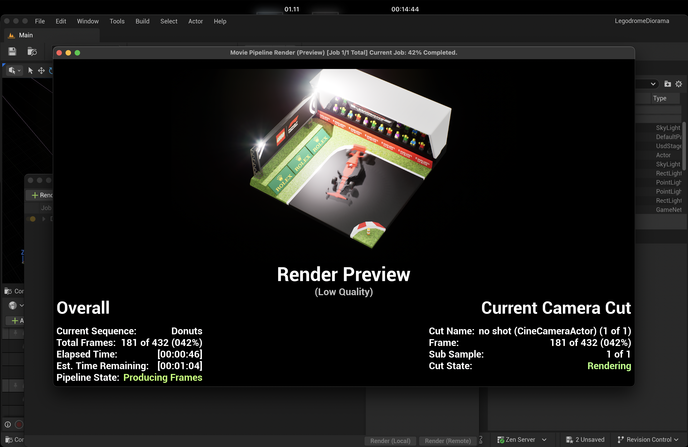

