# IMPORTANT!
### Download Racecar.obj file and place in meshes directory before running live server.

Download Racecar.obj: https://drive.google.com/file/d/1Rw0tY8EuQFYHubfgT9umyL-C3DdrIgPa/view?usp=sharing

It was too big to include as part of the repo.

## Transferring scene from Blender to WebGPU (by Ivan)

First I started by re-doing real-time graphics labs and build my code from them. Then after doing research and implementing OBJ parser and finding a way read and convert vertices from blender files and getting comfortable, I moved back to blender.

In blender I first combined all objects into 2 meshes, the legodrome which has all objects that belong to the racetrack environment and the racecar itself with driver and tyres. 

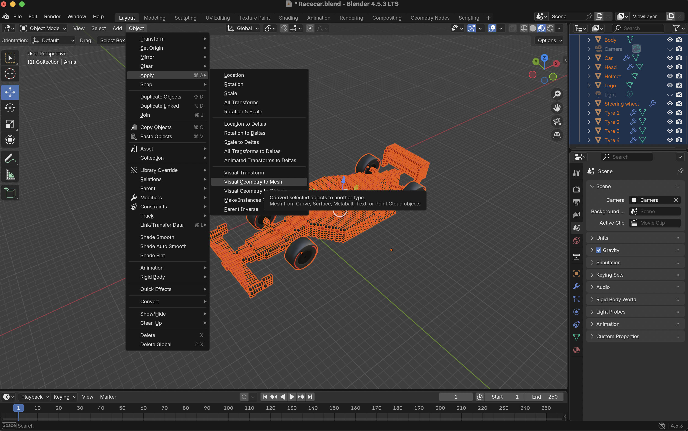

Then I tried running the code on obj Racecar model I exported and it first came out like this with tyres not being drawn correctly.

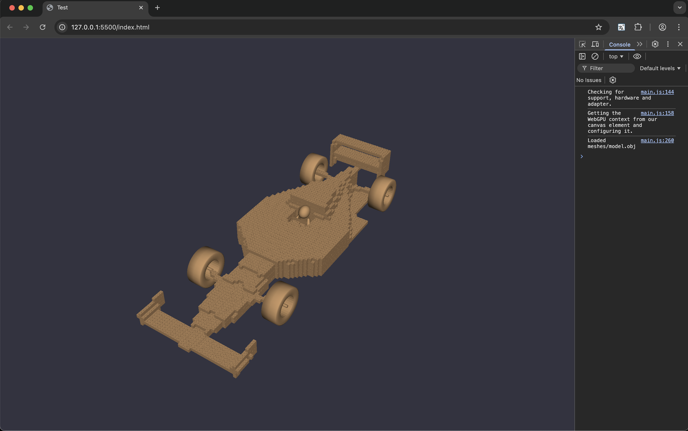
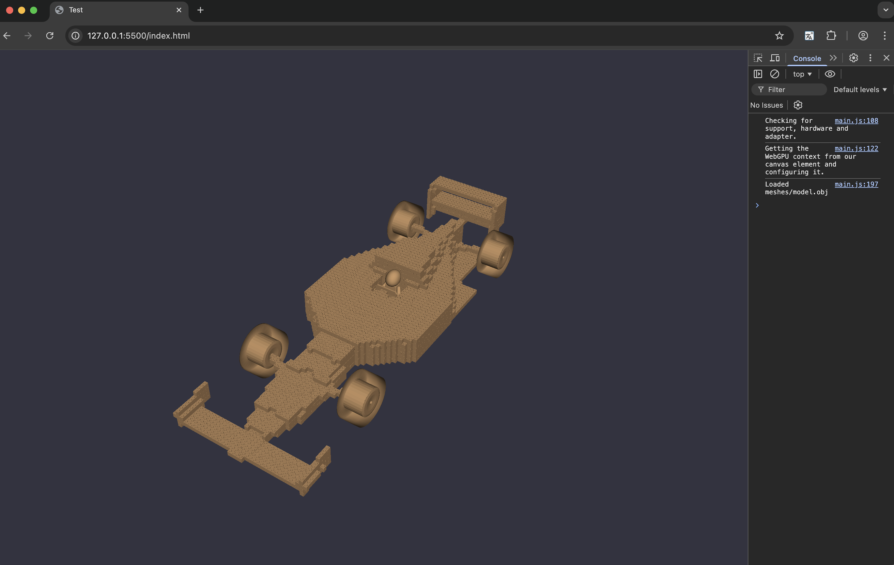

Mano helped me fix this issue by cullmode to none in the main javascript file to get rid of inside out rendering.

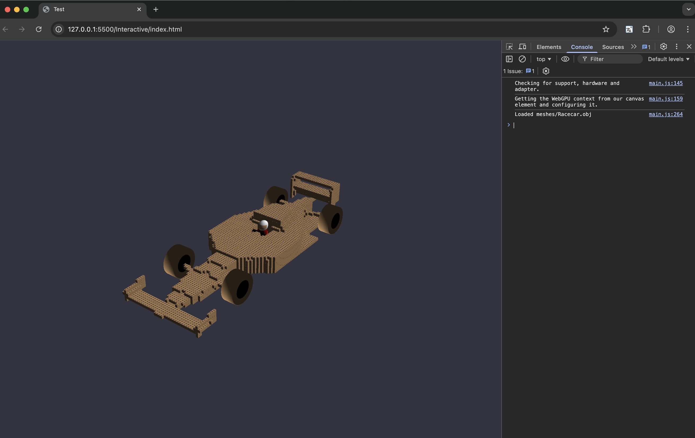

Then I moved onto texture mapping. I imported all texture images from Blender to my directory and hardocded them for faster load times.

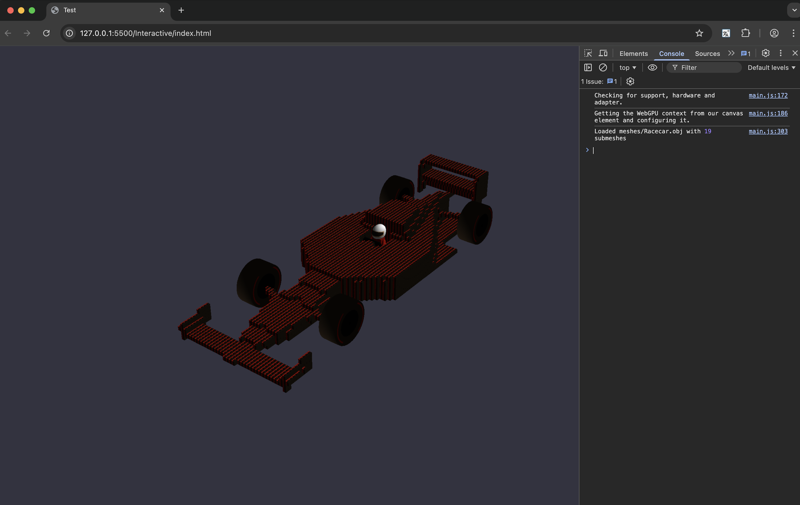

The livery for the car didn't map correctly as with geometry nodes it treats each lego piece individually, I had similar issue when converting to UE. So I went back to Blender and used my other model with each 10k+ individual lego pieces.

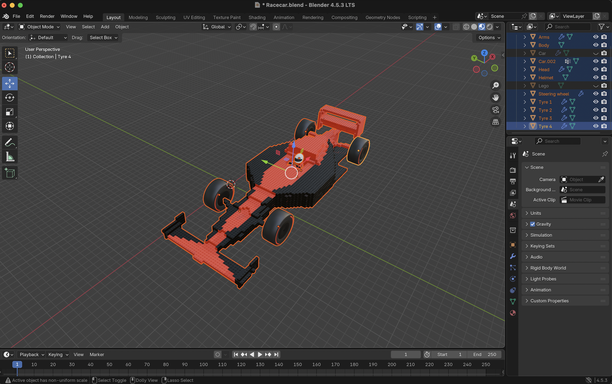
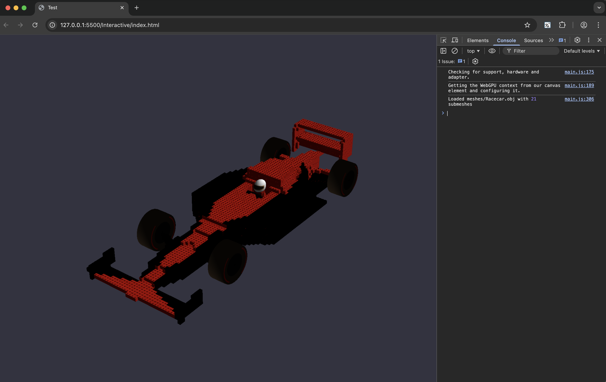

Next challenging task was to paint all 11,000 lego pieces in the same livery like in the render file. I ended up creating multiple UV maps from different sides to transfer the livery and now I was done with importing car model to WebGPU.

I moved on to importing rest of the environment, which proved difficult due to custom textures for asphalt and grass materials. 

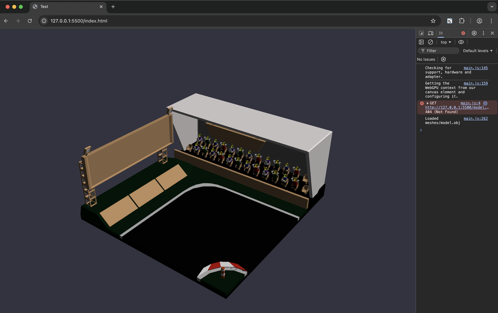

I went back to Blender and baked the materials while also creating custom textures again for the grass and asphalt. 

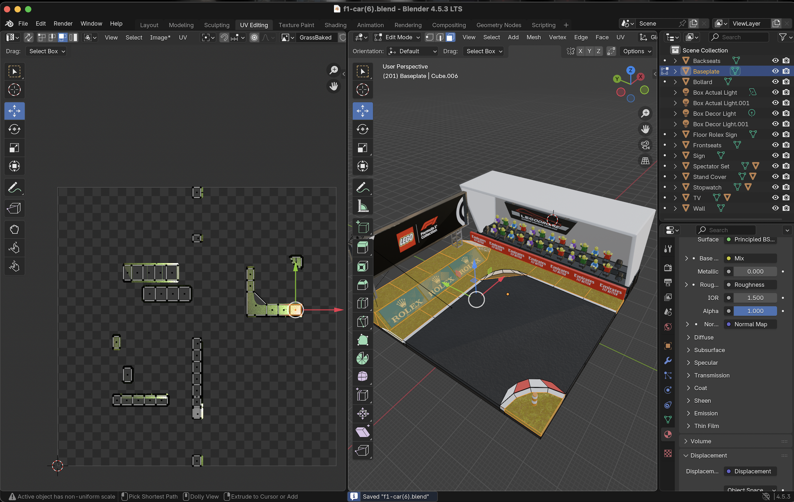

Baking of textures worked fine for grass, but for asphalt it didn't due to the complexity of the custom material I previously created. I also fixed positioning of the car to start getting the feel of the scene together.

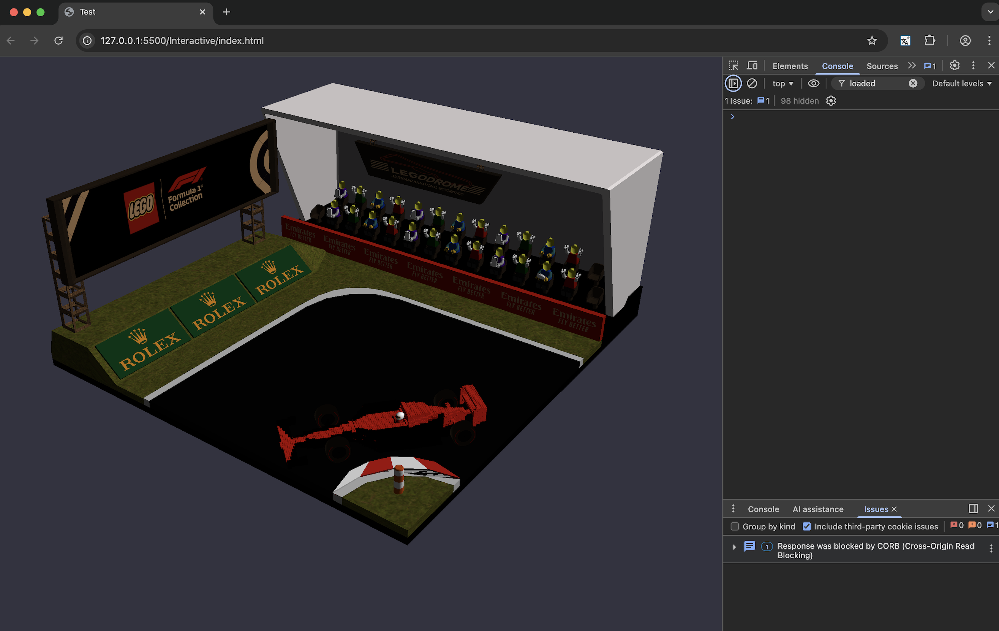

So I opted to create a custom material based on my texture and skipping the baking process for asphalt. 

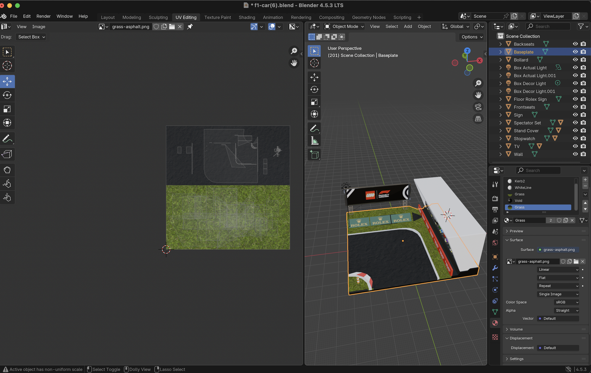

That proved difficult as it affected other textures as well.

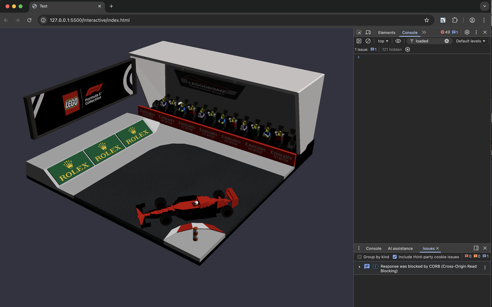

After going back and forth between WebGPU code and Blender and constantly making changes on both ends, I was able to all major issues regarding big meshes.

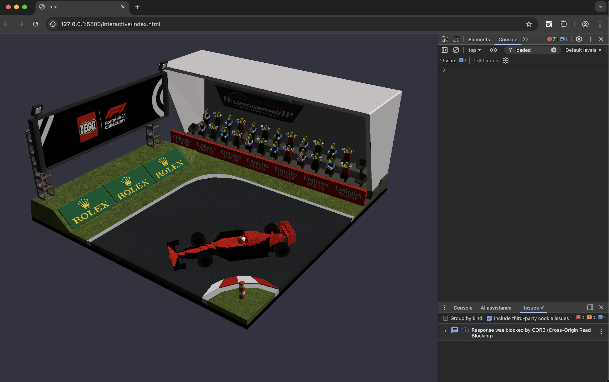

Last fixes to the environment were arms and faces of the minifigures in the audience, that was just a texture naming and mapping issue which I was able to resolve by correctly reading and parsing mtl code for the models

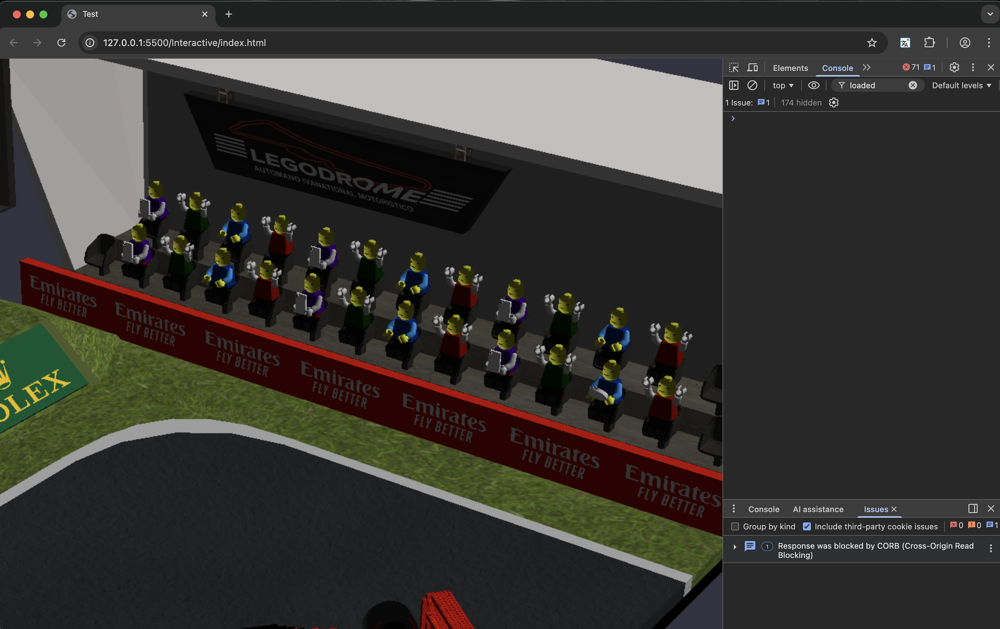

This was the final result after cleaning my code and getting the desired quality of the scene imported from Blender to WebGPU

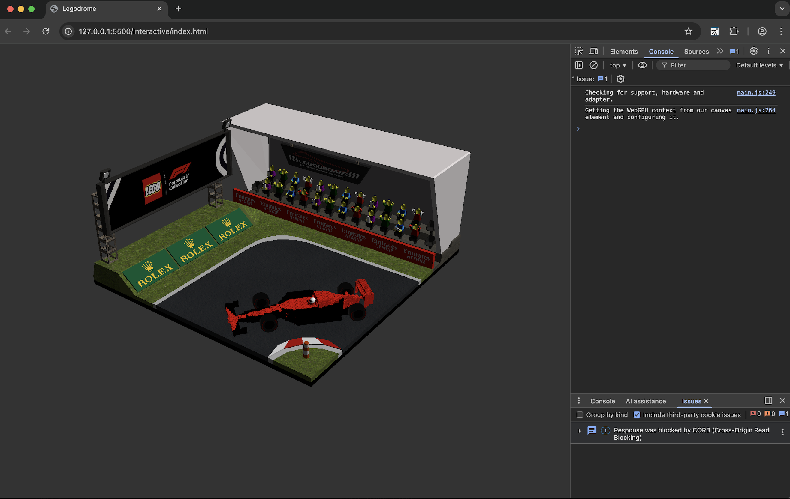